# Review Company Microservices App with DevOps Tools (Jenkins, Docker, K3S) Intergated With Security (SonarQube, Trivy) and Monitoring (Prometheus, Grafana) 

## System building process

  
   
  <em>System building process</em>

## Demo
https://drive.google.com/drive/folders/1SB27Nu54opv8osg-UCYNrRhS6b0_iMfX?usp=drive_link

## Create Infrastructure with CloudFormation Stack

  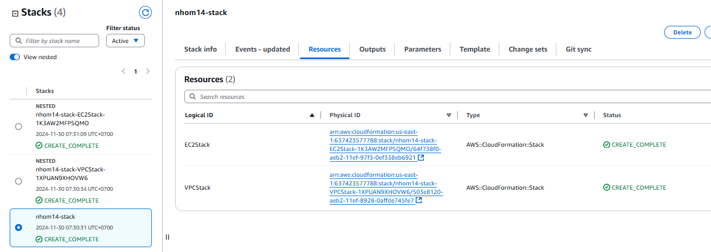
   
  <em>Cloud Formation Stack</em>

  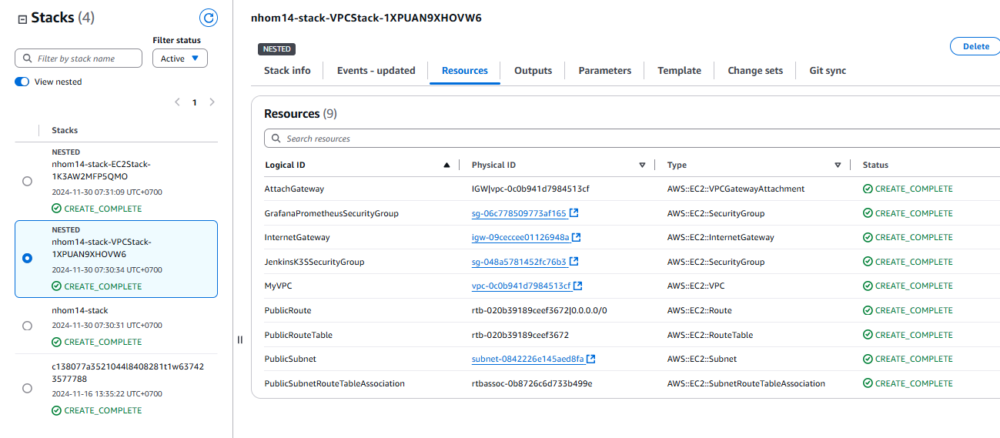
   
  <em>VPC Stack</em>

  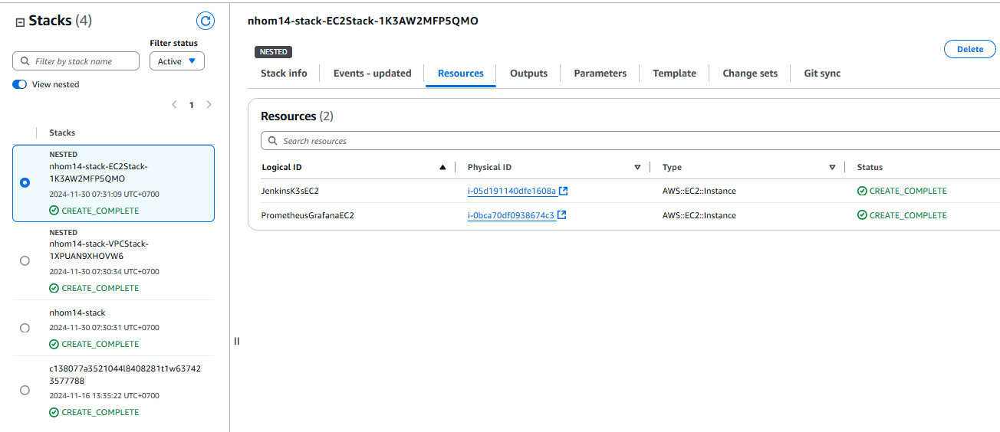
   
  <em>EC2 Stack</em>

## Jenkins Pipeline

  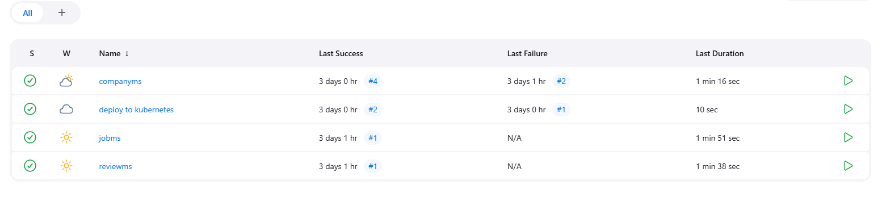
   
  <em>Jenkins Pipeline CI/CD</em>

  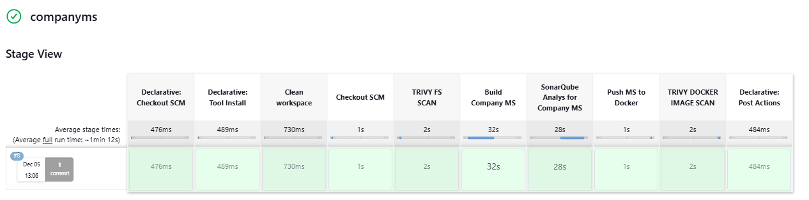
   
  <em>Company Microservices Pipeline Step</em>

  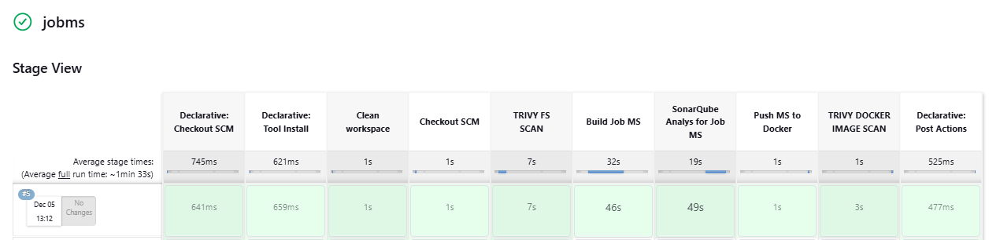
   
  <em>Job Microservices Pipeline Step</em>

  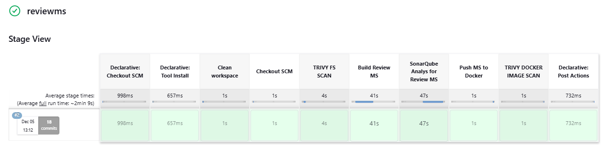
   
  <em>Review Microservices Pipeline Step</em>

  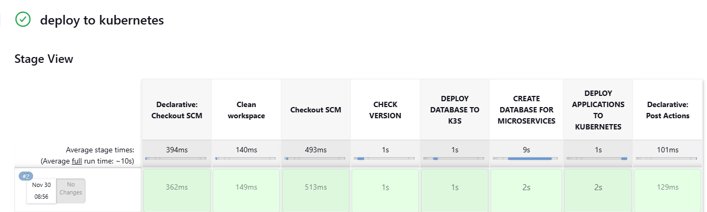
   
  <em>Company Microservices Pipeline Step</em>

## SonarQube

  
   
  <em>Scan code Company-MS, Job-MS, Review-MS</em>

## Docker Hub

  
   
  <em>Docker Hub</em>

## K3S

  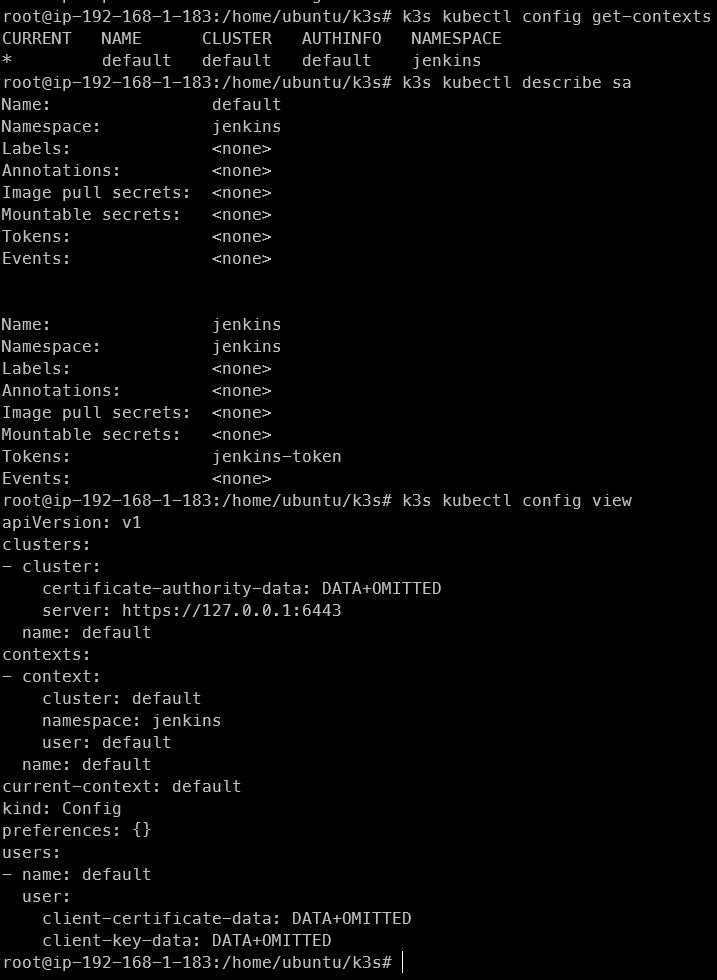
   
  <em>K3S Config</em>

  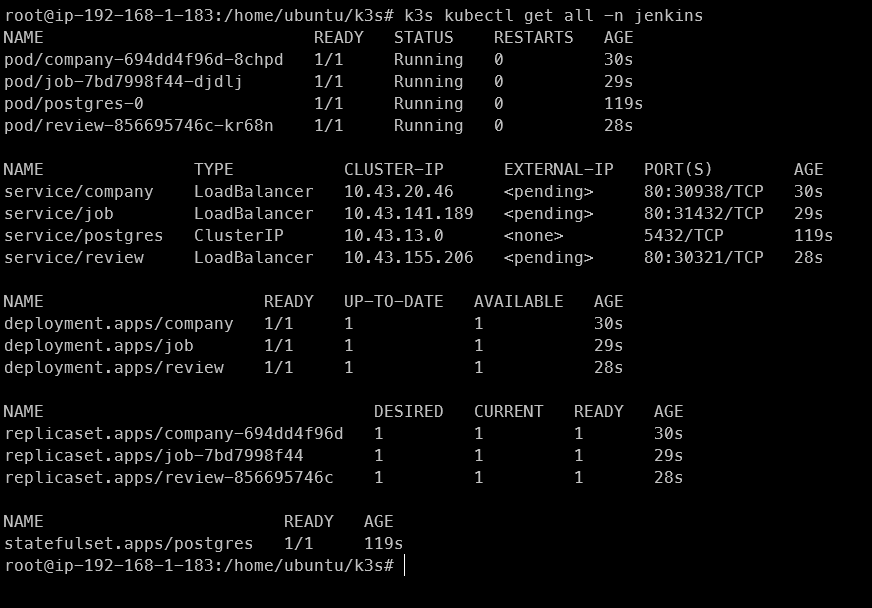
   
  <em>Resource K3S</em>

## Prometheus

  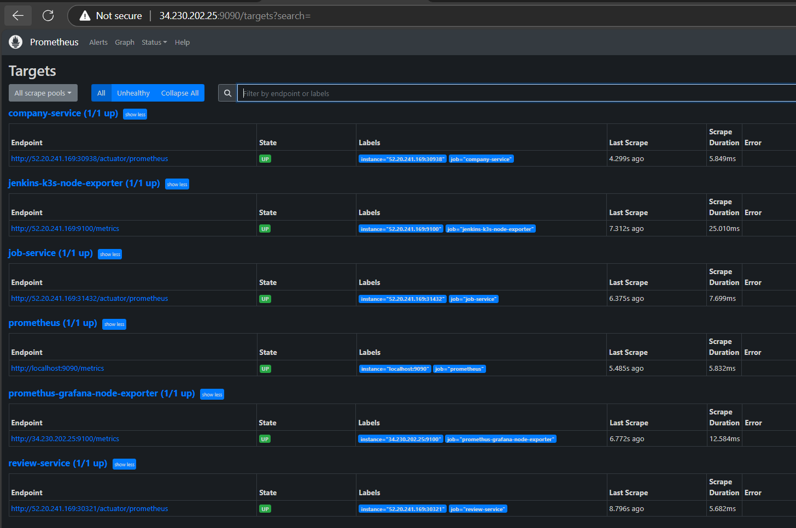
   
  <em>Prometheus Job</em>

## Grafana

  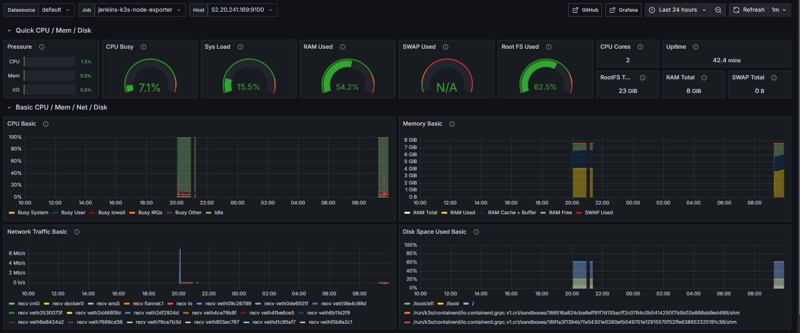
   
  <em>Node Exporter Dashboard</em>

  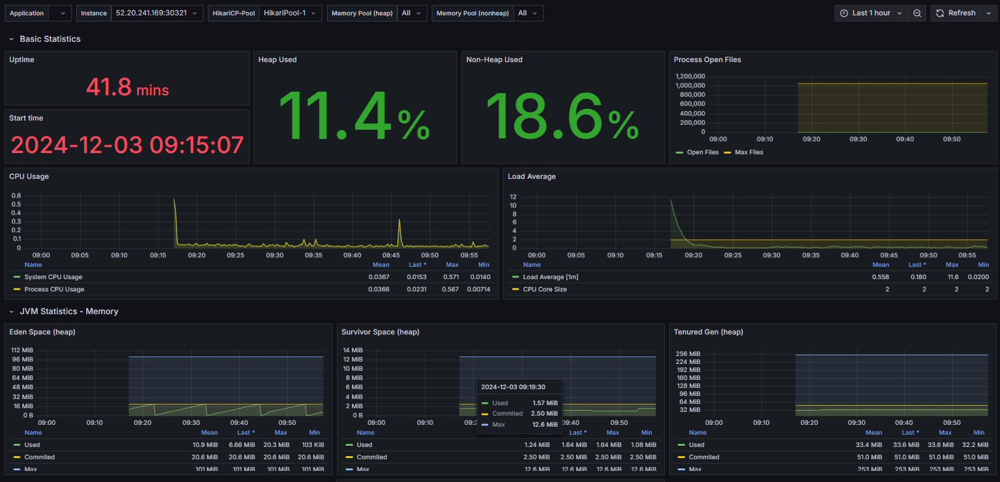
   
  <em>Microservices Application Dashboard</em>

