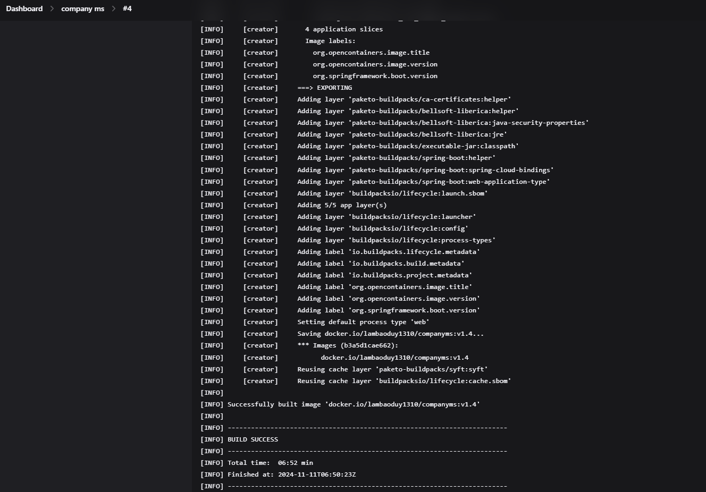

# Review Company Microservices App with DevOps Jenkins CI/CD Pipline, Security with Trivy, SonaryQube and Deploys with Docker and K8s

## Install Jenkins and SonarQube with Docker Compose and Dockerfile

  
   
  <em>Install Dependencies and Build code Succesfully</em>

## Jenkins Pipeline

  
   
  <em>Company Microservices Pipeline Step</em>

  
   
  <em>Job Microservices Pipeline Step</em>

  
   
  <em>Review Microservices Pipeline Step</em>

## Console Output for each Microservies

  
   
  <em>Install Dependencies and Build code Succesfully</em>

  
   
  <em>Scan code with Sonar Scanner</em>

  
   
  <em>Scan code with Trivy</em>

  
   
  <em>Login and push docker image to Docker Hub</em>

  
   
  <em>Install Dependencies and Build code Succesfully</em>

  
   
  <em>Pipeline Successfully</em>

> Console Output tương tự với Job Microservice và Review Microservice.

## SonarQube

  
   
  <em>Scan code Company-MS, Job-MS, Review-MS</em>

## Docker Hub

  
   
  <em>Docker Hub</em>

## Minikube 

  
   
  <em>Docker Hub</em>

